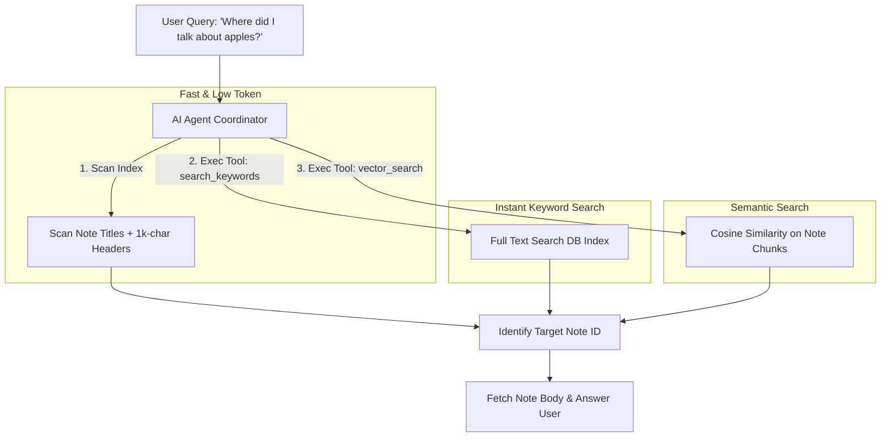

# Project Plan: Friday — CLI-Themed Notes Assistant

**Friday** is a minimalist, developer-themed web notes application with an AI agent. 

---

## 🎨 CLI-Style Aesthetics (Terminal Look)
*   **Colors**: Monospaced typography, dark background (`#0d0e11`), glowing terminal green (`#4af626`) or amber text accents, clean solid borders.
*   **Editor**: A distraction-free pane with the note's text count fixed in the top right.
*   **Dashboard**: A clean shell prompt (e.g., `friday@notes:~$ `) where you can select folders, view notes, or toggle the AI terminal drawer.

---

## 📝 Data Structure
```typescript
interface Note {
  id: string;
  folderId: string;
  title: string;       // Max 100 chars
  header?: string;     // Max 1000 chars, optional/AI-generated context summary
  body: string;        // Max 100,000 chars
  textCount: number;   // Word/char count updated in real-time
  updatedAt: string;
}

interface Folder {
  id: string;
  name: string;
}
```

---

## 🔍 How to Solve the 100k Character Token Search Challenge

Feeding multiple 100,000-character notes directly into the LLM context will exceed rate limits, cost too much, and introduce latency. Here are **three practical strategies** to implement:



### Strategy A: AI-Generated Header Indexing (Recommended for MVP)
*   **Concept**: When a note is saved, you use Gemini to generate a high-quality 1000-character **Contextual Header** (capturing core keywords, summaries, and key topics discussed in the body).
*   **Search**: Instead of reading the full bodies, the agent is fed only the list of **Folder names + Note Titles + 1000-character Headers**. This is highly compressed and fits easily into a single LLM prompt.

### Strategy B: Full-Text Search (FTS) Tool (Keyword-based)
*   **Concept**: Keep notes indexed in a local database (like SQLite with `FTS5` or PostgreSQL `tsvector`).
*   **Search**: Provide the agent with a tool: `searchNotesByKeyword(query: string)`. The agent translates the user's natural prompt into search keywords, calls the tool, and receives a list of note IDs + text snippets.

### Strategy C: Chunked Vector Embeddings (Semantic-based)
*   **Concept**: Split the 100k-character note body into 1000-character chunks. Generate embeddings for each chunk and store them in a local vector database.
*   **Search**: When the user asks a question, run a vector similarity search to find the top 3-5 chunks matching the prompt. Feed only those chunks to the agent to form its final answer.

---

## 🛠️ Step-by-Step Implementation Roadmap

### Phase 1: The CLI Notes App (Frontend + Backend)
1.  **Frontend Layout**: Build a directory tree on the left and a central terminal-style note editor in React. Include a character counter on the top right.
2.  **State/API**: Build simple REST endpoints:
    *   `POST /folders`
    *   `POST /notes`
    *   `GET /folders/:id/notes`
3.  **Local Storage/DB**: Set up a simple local SQLite file to persist folders and notes.

### Phase 2: AI-Generated Headers
1.  Add an **"AI Generate Header"** button to the note editor.
2.  When clicked, the client sends the title and body to the Express server. The server uses Gemini (via `@google/genai`) to generate a summary/header under 1000 characters and saves it.

### Phase 3: The Search Agent Integration
1.  Build a command-line drawer in the web client (e.g. opens by typing `/ask` or a keyboard shortcut).
2.  Equip the agent with tools:
    *   `search_notes_by_header(query)`: Performs a simple text/embedding search on note headers.
    *   `get_note_content(noteId)`: Fetches the full text of a specific note once the target is identified.
3.  Test user queries: "Which folder contains my note about apples and oranges?"
